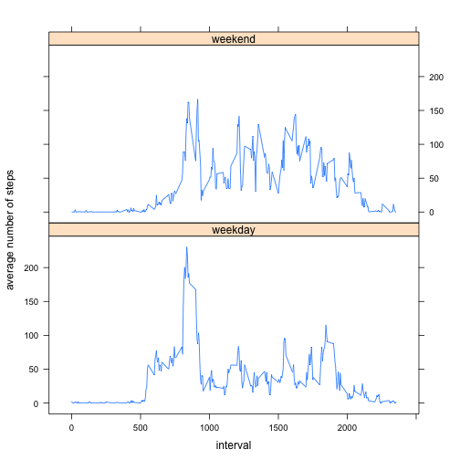

Reproducible Research: Peer Assessment 1
===================================
##Loading and preprocessing the data
1.Load the data

```r
rawdata<-read.csv("activity.csv")
```

##What is mean total number of steps taken per day?
1.Make a histogram of the total number of steps taken each day

```r
totalsteps<-aggregate(rawdata$steps ~ rawdata$date,data=rawdata,sum)
colnames(totalsteps)<-c("date","totalsteps")
hist(totalsteps$totalsteps,
     main="Histogram of the total number of steps taken each day",
     xlab="steps")
```

 

2.Calculate and report the mean and median total number of steps taken per day

```r
totalmean<-mean(totalsteps$totalsteps)
totalmedian<-median(totalsteps$totalsteps)
```
The mean total number of steps taken per day is 1.0766189 &times; 10<sup>4</sup>.
The median total number of steps taken per day is 10765.

##What is the average daily activity pattern?
1.Make a time series plot (i.e. type = "l") of the 5-minute interval (x-axis) and the average number of steps taken, averaged across all days (y-axis)

```r
intervalsteps<-aggregate(rawdata$steps ~ rawdata$interval,data=rawdata,mean)
colnames(intervalsteps)<-c("interval","meansteps")
plot(intervalsteps$interval,intervalsteps$meansteps,type="l",
     main="Average daily activity pattern",
     xlab="interval",ylab="average number of steps")
```

 

2.Which 5-minute interval, on average across all the days in the dataset, contains the maximum number of steps?

```r
maxinterval<-intervalsteps[which.max(intervalsteps$meansteps),1]
```
The 835 5-minute interval, on average across all the days in the dataset, contains the maximum number of steps.

##Imputing missing values
1.Calculate and report the total number of missing values in the dataset (i.e. the total number of rows with NAs)

```r
nrow(rawdata[is.na(rawdata[,1]),])
```

```
## [1] 2304
```

2.Devise a strategy for filling in all of the missing values in the dataset. The strategy does not need to be sophisticated. For example, you could use the mean/median for that day, or the mean for that 5-minute interval, etc.

I decide to use the mean for that 5-minute interval to fill in all of the missing values in the dataset.Because the mean for that 5-minute interval allways exist,n opposition to the mean/median for that day which isn't allways exist(e.g. 2012-10-01).

3.Create a new dataset that is equal to the original dataset but with the missing data filled in.

```r
rawdata2<-read.csv("activity.csv")
rawdata2$steps<-as.numeric(rawdata2$steps)
missvalueset<-which(is.na(rawdata2$steps))
for(i in missvalueset){
  j<-(rawdata2[i,3] %/% 100)*60+(rawdata2[i,3] %% 100)
  j<-j/5+1
  rawdata2[i,1]<-intervalsteps[j,2]
}
```

4.Make a histogram of the total number of steps taken each day and Calculate and report the mean and median total number of steps taken per day. Do these values differ from the estimates from the first part of the assignment? What is the impact of imputing missing data on the estimates of the total daily number of steps?

```r
totalsteps2<-aggregate(rawdata2$steps ~ rawdata2$date,data=rawdata2,sum)
colnames(totalsteps2)<-c("date","totalsteps")
hist(totalsteps2$totalsteps,
     main="Histogram of the total number of steps taken each day",
     xlab="steps")
```

 


```r
totalmean2<-mean(totalsteps2$totalsteps)
totalmedian2<-median(totalsteps2$totalsteps)
```
The mean total number of steps taken per day is 1.0766189 &times; 10<sup>4</sup>.
The median total number of steps taken per day is 1.0766189 &times; 10<sup>4</sup>.

The mean value is the same as first part,but the median value is a bit different.But from the histograms we can see that the frequency between 10000 and 15000 increase a lot for the filling dataset.

##Are there differences in activity patterns between weekdays and weekends?
1.Create a new factor variable in the dataset with two levels – “weekday” and “weekend” indicating whether a given date is a weekday or weekend day.

```r
rawdata2$date<-as.Date(rawdata2$date)
rawdata2$weekday<-ifelse(weekdays(rawdata2$date)=="Saturday" | 
                           weekdays(rawdata2$date)=="Sunday",
                         "weekend","weekday")
rawdata2$weekday<-factor(rawdata2$weekday)
```

2.Make a panel plot containing a time series plot (i.e. type = "l") of the 5-minute interval (x-axis) and the average number of steps taken, averaged across all weekday days or weekend days (y-axis). See the README file in the GitHub repository to see an example of what this plot should look like using simulated data.

```r
intervalsteps2<-aggregate(rawdata2$steps ~ 
                            rawdata2$interval + rawdata2$weekday,
                          data=rawdata2,mean)
colnames(intervalsteps2)<-c("interval","weekday","meansteps")
library(lattice)
xyplot(meansteps ~ interval | weekday,data=intervalsteps2,
       layout=c(1,2),xlab="interval",ylab="average number of steps",
       type="l")
```

 
